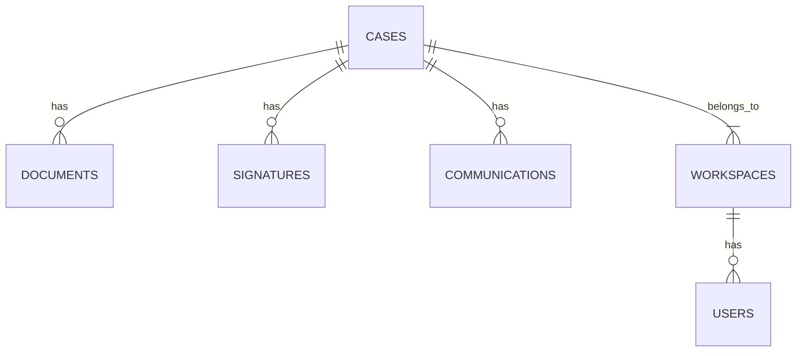

# Schema Unification Plan

## Migration Overview
- **Original System**: Firebase Firestore (NoSQL)
- **New System**: SQLite (Relational)
- **Migration Date**: July 2025
- **Goal**: Single source of truth for all data models

## Key Changes
| Aspect | Firestore | SQLite |
|--------|-----------|--------|
| Data Structure | Document-based | Relational tables |
| Schema | Flexible | Strictly typed |
| Queries | Limited join capabilities | Full SQL joins |
| Transactions | Limited | ACID compliant |

## Implementation Status
✅ Completed:
- Unified schema definitions (database-schema.ts)
- Database service layer (database.ts)
- Core entity migrations (Cases, Contacts, Bikes)

⚠️ In Progress:
- API route updates
- Testing coverage
- Performance optimization

## Remaining Tasks
1. [ ] Complete API route audits
2. [ ] Implement transaction safety
3. [ ] Add comprehensive tests
4. [ ] Remove all Firebase dependencies

## Schema Comparison

## Verification Checklist
- [ ] All CRUD operations tested
- [ ] Data integrity verified
- [ ] Performance benchmarks
- [ ] Backup/restore tested